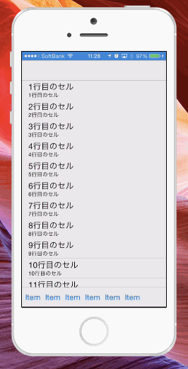

iOSAutoHiddenBar
================

スクロールすると自動的に隠れるNavigationBarとToolbarのサンプル

仕組み
=====

スクロールした際に、総スクロール totalOffset の移動量が一定（kAutoHiddenOffset）以上の場合NavigationBarとToolbarを非表示にします。

またNavigationBarとToolbarの表示・非表示が切り替わるため、テーブルとテーブルのスクロールバーの余白設定を調整しています。

またスクロール開始時（scrollViewWillBeginDragging）にて総スクロール量 totalOffsetを初期化し再度判定に備えています。
